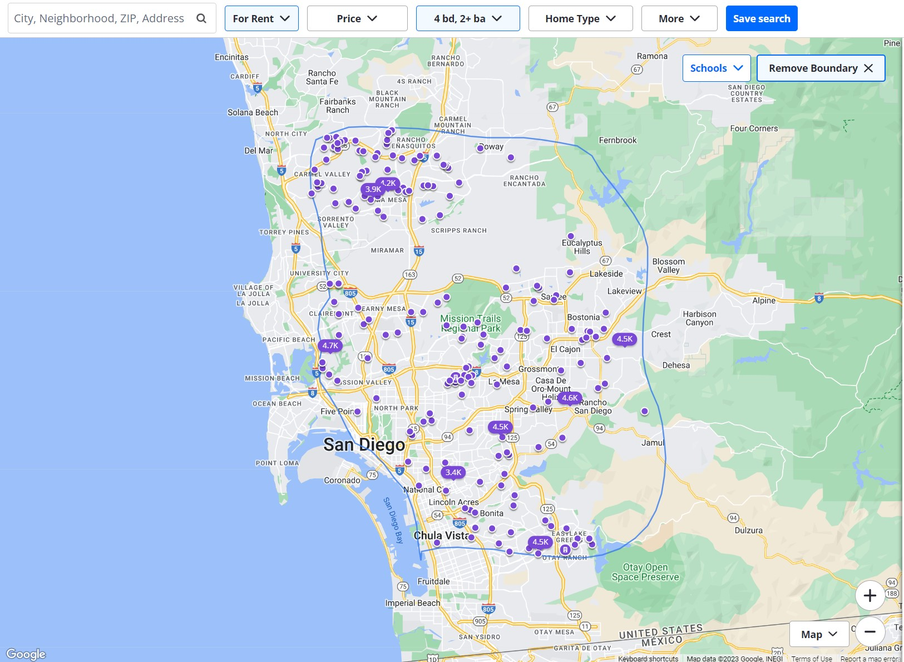
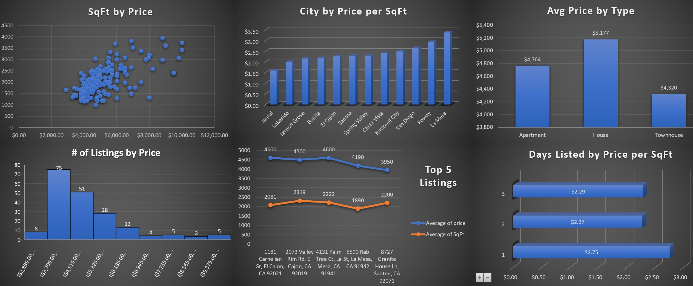

# Analyzing Rental Properties in San Diego County

## Overview

A colleague and her 4 roommates are seeking a suitable rental property in San Diego County to facilitate their daily commutes to their respective workplaces or graduate schools. The purpose of this data-driven project is to employ web scraping, data wrangling, data cleaning, and exploratory data analysis techniques to comprehensively analyze rental properties in San Diego County. By leveraging these data science tools, the project aims to identify the most appropriate rental candidate that aligns with the needs and preferences of the 5 professionals, thereby facilitating an informed and optimal housing decision. 

## Table of Contents
- [map_search_area.jpg](#map_search_area)
- [rental_data.py](#rental_data_webscraper)
- [rentals_scraped.csv](#rentals_scraped_uncleaned)
- [dashboard_rentals_project.jpg](#rental_properties_dashboard)
- [retnals_scraped_excel_](#excel_workbook_data)

## Project Goals

The primary objectives of this project are as follows:

1. Web Scraping: Utilize web scraping techniques to extract relevant rental listings data from Zillow's website for properties in San Diego County.

2. Data Wrangling and Cleaning: Process and clean the collected data using SQL and Excel to create a structured and reliable dataset for analysis. Handle missing values, remove duplicates, and address any inconsistencies in the data. 

3. Exploratory Data Analysis (EDA): Conduct thorough exploratory data analysis on the curated dataset. Utilizing Excel features such as pivot tables, Vlookup, Hlookup, charts, and visualizations with slicers in order to create data-driven insights on a simple and easy to understand dashboard.

4. Rental Candidate Identification: Based on the insights obtained through EDA, identify potential rental candidates and specific cities that best match the preferences and requirements of the 5 professionals. Consider factors such as proximity to workplaces or schools, rental affordability, property size, and amenities.

## Methodology

1. **Web Scraping**: The project utilizes Python's requests library to make API requests to Zillow's servers via the "Scrapeak" API and retrieve rental listings data. The API key required for access is stored in a secure `creds.py` file, excluded from version control.

2. **Data Wrangling and Cleaning**: After collecting the rental listings data, a custom data cleaning pipeline is implemented to transform the raw data into a more structured DataFrame. The final steps to utilize data wrangling and cleaning will be done via SQL and Excel, including addressing missing values, data type conversions, and data formatting.

3. **Exploratory Data Analysis**: The python file `rental_data.py` contains some of the EDA process. Descriptive statistics and data visualizations using Excel are used to analyze the distribution of rental prices, explore correlations between features, and identify potential patterns and outliers.

4. **Rental Candidate Selection**: Based on the insights gained from EDA, the project narrows down rental candidates that are likely to meet the preferences and needs of the 5 professionals.

